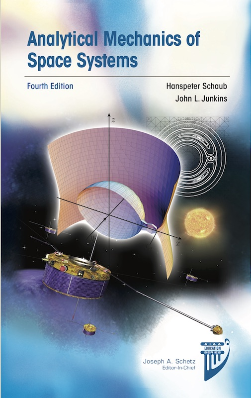

# Spacecraft-Dynamics-and-Control

This repository contains lecture notes and solutions to the problems on the following courses by Prof. Hanspeter Schaub
1. *[Spacecraft Dynamics and Control](sdc)*
2. *[Advanced Spacecraft Dynamics and Control](advanced_sdc)*
3. *[Spacecraft Formation Relative Orbits](formation_flying)*

  

There are also solved problems and simulation software for selected chapters of the book *Analytical Mechanics of Space Systems* by Schaub and Junkins, which is used as the main reference for the above courses.
